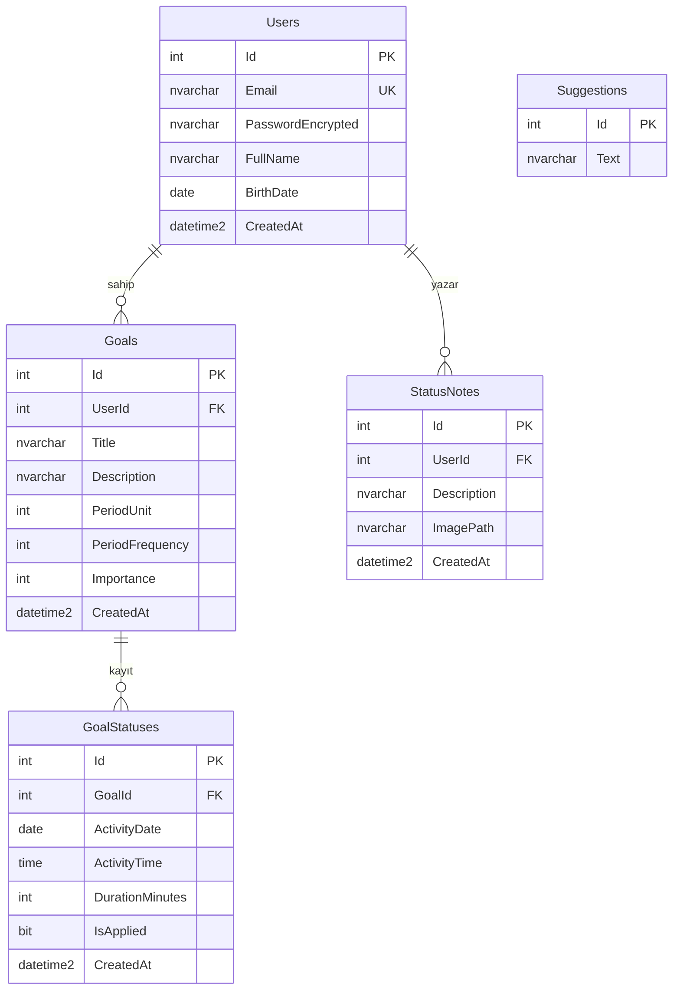

# Veritabanı Şeması — Ağız ve Diş Sağlığı Takip Uygulaması

> EF Core Code-First. C# entity sınıfları aşağıdaki tablolara karşılık gelir.
> MSSQL. Tüm ilişkiler FK ile yönetilir.

## Tablolar

### Users
Kullanıcı hesapları.

| Kolon | Tip | Açıklama |
|---|---|---|
| Id | int (PK, identity) | Birincil anahtar |
| Email | nvarchar(256), unique | Benzersiz, giriş için |
| PasswordEncrypted | nvarchar(max) | AES ile şifreli parola (geri çözülebilir) |
| FullName | nvarchar(150) | Ad-soyad |
| BirthDate | date | Doğum tarihi |
| CreatedAt | datetime2 | Kayıt zamanı |

### Goals
Kullanıcıya ait hedefler (fırçalama, diş ipi vb.).

| Kolon | Tip | Açıklama |
|---|---|---|
| Id | int (PK, identity) | |
| UserId | int (FK → Users.Id) | Hedefin sahibi |
| Title | nvarchar(150) | Başlık |
| Description | nvarchar(500) | Açıklama |
| PeriodUnit | int (enum) | Periyot birimi (Gün/Hafta/Ay) |
| PeriodFrequency | int | Sıklık (ör. "günde 2" → birim=Gün, freq=2) |
| Importance | int (enum) | Önem: 0=Düşük, 1=Orta, 2=Yüksek |
| CreatedAt | datetime2 | |

### GoalStatuses
Bir hedefe karşı girilen uygulama kayıtları.

| Kolon | Tip | Açıklama |
|---|---|---|
| Id | int (PK, identity) | |
| GoalId | int (FK → Goals.Id) | Hangi hedef |
| ActivityDate | date | Tarih |
| ActivityTime | time | Saat |
| DurationMinutes | int | Süre (dakika) |
| IsApplied | bit | Uygulandı mı |
| CreatedAt | datetime2 | |

### StatusNotes
Durum sekmesindeki serbest not + görsel.

| Kolon | Tip | Açıklama |
|---|---|---|
| Id | int (PK, identity) | |
| UserId | int (FK → Users.Id) | Notun sahibi |
| Description | nvarchar(1000) | Açıklama metni |
| ImagePath | nvarchar(500), null | Görsel dosya yolu (dosya sistemine kaydedilir) |
| CreatedAt | datetime2 | |

### Suggestions
Ortak öneri havuzu (kullanıcıya bağlı değil).

| Kolon | Tip | Açıklama |
|---|---|---|
| Id | int (PK, identity) | |
| Text | nvarchar(500) | Öneri metni |

## İlişkiler

- **Users 1 —— N Goals** (bir kullanıcının çok hedefi)
- **Goals 1 —— N GoalStatuses** (bir hedefin çok durum kaydı)
- **Users 1 —— N StatusNotes** (bir kullanıcının çok notu)
- **Suggestions**: bağımsız (ilişkisiz) havuz

## Enum Değerleri

**Importance:** 0 = Düşük, 1 = Orta, 2 = Yüksek
**PeriodUnit:** 0 = Gün, 1 = Hafta, 2 = Ay

## ER Diyagramı (Mermaid)

## Silme Davranışı Notu

- Hedef silinince ona bağlı `GoalStatuses` kayıtları da silinmeli → **Cascade delete** (EF Core'da FK ilişkisinde ayarlanır).
- Form gereği: durum kaydı olan bir hedef silinmeden önce kullanıcıdan onay istenecek (bu iş **frontend/backend mantığında** kontrol edilecek, DB seviyesinde değil).
